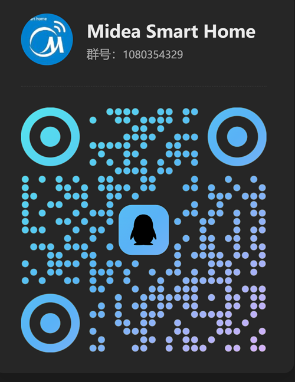

# Midea Smart Home

[![GitHub Release][releases-shield]][releases]
[![GitHub Activity][commits-shield]][commits]
[![License][license-shield]](LICENSE)
[![hacs][hacsbadge]][hacs]

Home Assistant 美的设备本地控制集成，无需云端即可控制您的智能设备。

## 获取帮助

- 欢迎加入QQ群交流，获取最新更新和帮助：

## 功能特点

- **本地控制**：设备通过本地网络直接控制，无需依赖云端连接
- **自动下载协议**：自动从云端下载设备对应的 Lua 协议脚本（首次配置）
- **灵活配置**：支持通过设备映射文件自定义实体属性，方便适配新设备
- **多语言支持**：支持中文、英文界面
- **丰富的实体平台**：支持 binary_sensor、button、climate、cover、fan、humidifier、light、lock、number、select、sensor、switch、text、time、update、vacuum、water_heater

## 工作流程

**配置阶段**

1. 用户输入美的账号密码
2. 登录美的云端 API

**发现阶段**

1. 从云端获取设备详细信息（设备ID、型号、SN8等）
2. 自动下载设备对应的 Lua 协议文件
3. 在本地局域网中扫描设备 IP 地址
4. 获取设备的 Token 和 Key（仅 V3 协议设备需要，V1/V2 协议设备无需）

**运行阶段**

1. 通过本地网络连接设备
2. 使用 Lua 脚本解析设备协议
3. 普通设备通过回调推送状态更新，特殊设备（如 0xD9 复式洗衣机）使用定时轮询
4. 用户操作直接发送到设备（无需云端）

## 环境要求

- **Home Assistant** >= 2025.12.4

## 安装

### 一键安装（推荐）

### HACS 自定义仓库

1. 在 Home Assistant 中打开 HACS
2. 进入"集成"
3. 点击右上角"+"按钮
4. 点击"⚙️ 自定义存储库"（3 点菜单 > 自定义存储库）
5. 输入：`https://github.com/Cyborg2017/midea_smart_home`
6. 类别选择：**集成**
7. 点击"添加"
8. 搜索"Midea Smart Home"并点击"下载"

### 手动安装

1. 将 `custom_components/midea_smart_home` 目录复制到您的 Home Assistant `custom_components` 文件夹
2. 重启 Home Assistant
3. 进入 设置 > 设备与服务
4. 点击"添加集成"
5. 搜索"Midea Smart Home"

## 配置

详细配置教程请查看 [配置指南](GUIDE.md)

## 支持的设备

| 序号 | 代码   | 设备类型          |
| ----- | ------ | ----------------- |
| 1  | 0x13 | 智能灯 / 风扇灯   |
| 2  | 0x17 | 晾衣架           |
| 3  | 0x26 | 浴霸            |
| 4  | 0x9C | 集成灶           |
| 5  | 0xA1 | 除湿机           |
| 6  | 0xAC | 柜式空调 / 壁挂空调 / 中央空调 & 风管机 / 新风 / 迷你新风 |
| 7  | 0xAD | 空气魔方（检测仪） |
| 8  | 0xB0 | 微波炉           |
| 9  | 0xB6 | 油烟机           |
| 10 | 0xB8 | 扫地机器人         |
| 11 | 0xBF | 微蒸烤一体机         |
| 12 | 0xC2 | 智能马桶         |
| 13 | 0xCA | 多开门冰箱         |
| 14 | 0xCC | Wifi线控器 (中央空调 / 风管机)         |
| 15 | 0xD9 | 复式洗衣机 (左右双筒 / 上下双筒)        |
| 16 | 0xDA | 波轮洗衣机         |
| 17 | 0xDB | 滚筒洗衣机         |
| 18 | 0xDC | 干衣机           |
| 19 | 0xE1 | 洗碗机           |
| 20 | 0xE2 | 电热水器          |
| 21 | 0xE3 | 燃气热水器         |
| 22 | 0xE6 | 壁挂炉           |
| 23 | 0xEA | 电饭煲         |
| 24 | 0xED | 净饮机 / 净水机 / 管线机 / 软水机 / 前置过滤器 |
| 25 | 0xF1 | 破壁机         |
| 26 | 0xFA | 风扇            |
| 27 | 0xFB | 取暖器           |
| 28 | 0xFC | 空气净化器         |
| 29 | 0xFD | 加湿器           |

> 其他类型的设备正在适配中，欢迎贡献代码！

## 致谢

本项目参考/使用了以下项目的部分代码：

- [midea_auto_cloud](https://github.com/sususweet/midea_auto_cloud)
- [midea_ac_lan](https://github.com/wuwentao/midea_ac_lan)
- [midea-local](https://github.com/midea-lan/midea-local)

[commits-shield]: https://img.shields.io/github/commit-activity/y/Cyborg2017/midea_smart_home.svg?style=for-the-badge
[commits]: https://github.com/Cyborg2017/midea_smart_home/commits/main
[hacs]: https://github.com/hacs/integration
[hacsbadge]: https://img.shields.io/badge/HACS-Custom-orange.svg?style=for-the-badge
[license-shield]: https://img.shields.io/github/license/Cyborg2017/midea_smart_home.svg?style=for-the-badge
[releases-shield]: https://img.shields.io/github/release/Cyborg2017/midea_smart_home.svg?style=for-the-badge
[releases]: https://github.com/Cyborg2017/midea_smart_home/releases
